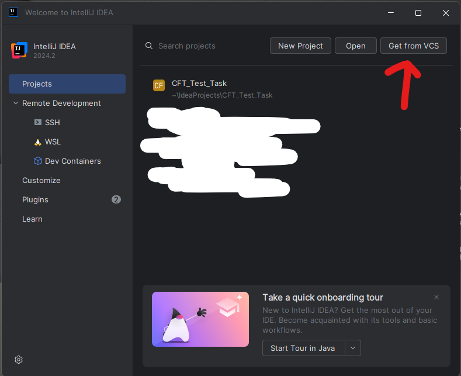
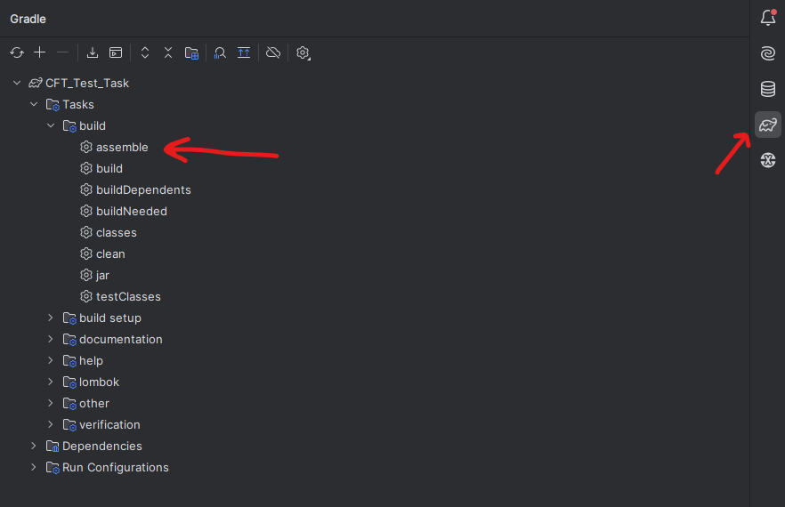
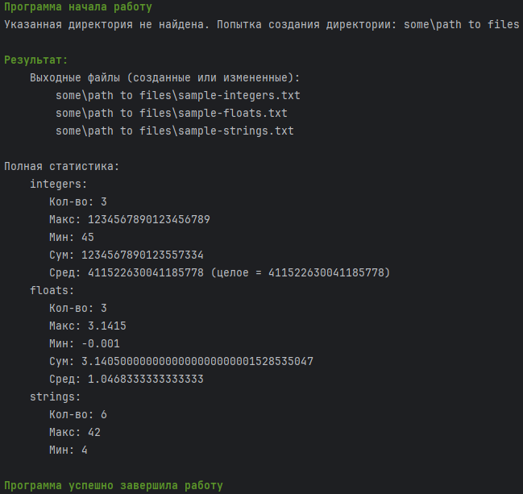

# **Утилита фильтрации содержимого файлов**
- **Java** 17
- **Gradle** 8.8
## **Сторонние библиотеки**
- **Apache Commands Cli** 1.8.0 [ссылка](https://commons.apache.org/proper/commons-cli/)

Эта библиотека используется для обработки аргументов командной строки.
```groovy
dependencies {
    implementation 'commons-cli:commons-cli:1.8.0'
}
```
- **Lombok** 8.7.1 [ссылка](https://projectlombok.org/)

Эта библиотека используется для реализации паттерна строителя, создания конструкторов.
```groovy
plugins {
    id "io.freefair.lombok" version "8.7.1"
}
dependencies {
    compileOnly 'org.projectlombok:lombok'
    annotationProcessor 'org.projectlombok:lombok'
}
```
- **Jansi** 2.4.0 [ссылка](https://mvnrepository.com/artifact/org.fusesource.jansi/jansi)

Эта библиотека используется для добавления тексту командной строки цвета и начертания.
```groovy
dependencies {
    implementation 'org.fusesource.jansi:jansi:2.4.0'
}
```
> Все выходные файлы создаются в кодировке UTF-8. Вывод в консоль так же производится в кодировке UTF-8.
> Если у вас возникают проблемы в отображении символов в консоли (как правило, на Windows), попробуйте ввести следующую команду в консоль:
> ```shell
> [Console]::OutputEncoding = [System.Text.Encoding]::UTF8
> ```
> или
> ```shell
> chcp 65001
> ```
> Если проблемы отображения не пропадают, откройте отдельно терминал Windows, вместо использования встроенного в IDE
## Система сборки
Проект использует систему сборки Gradle 8.8.
## Описание утилиты
Утилита получает на вход несколько текстовых файлов расширения .txt.
В них вперемешку записаны целые числа, строки и вещественные числа.
В качестве разделителя используется перевод строки.

Утилита сортирует содержимое файлов по типам данных: целые числа, числа с плавающей точкой (вещественные числа), строки.
Каждый тип данных записывается в соответсвующий файл (integers.txt, floats.txt, strings.txt).
При этом она проходится по одной строке каждого файла по очереди (сначала первые строки всех файлов по очереди, потом вторые строки и т.д.).
Иначе говоря, строки из файлов читаются по очереди в соответствии с их
перечислением в командной строке.

По умолчанию утилита создает выходные файлы в текущей папке/директории.

В процессе фильтрации собирается статистика: краткая - количество элементов, записанных в выходящие файлы; полная - для чисел
дополнительно содержит минимальное и максимальное значения, сумма и среднее.
Полная статистика для строк, помимо их количества, содержит также размер самой
короткой строки и самой длинной. Статистика выводится в консоль.
## Особенности 
* В процессе выполнения в консоль выводится сообщение о начале и завершении работы программы (последнее в случае успешного завершения).
* Программа выводит созданные файлы в консоль (в формате пути)
* В случае, если указанная пользователем директория не существует, она создается
* Если директорию невозможно создать, то программа продолжает работу, но выходные файлы не создаются и не записываются. Однако продолжается ведение статистики
* Если пользователь неверно указал входные файлы, утилита не прекратит работу и продолжит читать остальные файлы (пропустит проблемные)
* Если в процессе выполнения возникнет ошибка чтения или записи строки, программа так же продолжит работу, пропустив эту строку
* Если в процессе выполнения возникнет ошибка закрытия файла или процесса записи, программа продолжит работу
* Ели пользователь неверно указал опции при запуске, программа останавливает работу и выводит в консоль подсказку, как должен выглядеть запуск и какие опции поддерживаются
* В консоль выводятся все ошибки, сообщения, предупреждения и подсказки в процессе работы
* Если входные файлы указаны в формате **"имя.txt"**, то программа считает, что входные файлы находятся в текущей папке/директории

## Описание опций
- `-s`: вывод краткой статистики (количество элементов в выходных файлах)
- `-f`: вывод полной статистики (минимум, максимум, сумма, среднее для чисел; размер самой короткой и самой длинной строки для строк)
- `-a`: режим добавления в существующие файлы (по умолчанию перезаписываются)
- `-o <путь>`: задает путь для выходных файлов (по умолчанию результаты располагаются в текущей папке)
- `-p <префикс>`: задает префикс имен выходных файлов (по умолчанию: *integers.txt*, *floats.txt*, *strings.txt*)
> - Если вы указываете файл без пути, например **in1.txt**, утилита предполагает, что этот файл находится в текущей папке (директории).
    Чтобы указать файл в другой директории, используйте полный путь, например **"C:/files/in1.txt"**;
> - Если директория или имя файла содержит пробелы, обязательно указывайте путь в кавычках. Например: **"C:/my files/in1.txt"**;
> - Если вы указываете несуществующую директорию в параметре **-o**, например **"C:/output/files"**, утилита автоматически создаст эту директорию.
    Однако, если вы укажете относительный путь, например **"some/path"**, директория будет создана в текущей папке/директории.
## Сборка проекта
1. Клонируйте репозиторий и перейдите в корневую директорию проекта:
```shell
git clone https://github.com/trabka251/cft_test_task.git
cd cft_test_task
```
Или через Get from VCS


2. Выполните следующую команду для сборки проекта и создания JAR-файла:
```shell
./gradlew build
```
*или*
```shell
gradlew build
```
*или*
```shell
./gradlew assemble
```
Или откройте панель Gradle, Tasks->build->assemble (дважды щелкнуть)


## Запуск утилиты
После сборки проекта JAR-файл будет создан в директории build/libs с именем **CFT_Test_Task-1.0-SNAPSHOT.jar.**
Для запуска утилиты из корневой папки проекта используйте следующую команду:
```shell
java -jar build/libs/CFT_Test_Task-1.0-SNAPSHOT.jar [options] [inputFiles]
```
Для запуска утилиты из любого места (любой папки/директории) на ПК необходимо вместо **build/libs/CFT_Test_Task-1.0-SNAPSHOT.jar** вставить абсолютный путь до JAR-файла **CFT_Test_Task-1.0-SNAPSHOT.jar**, например:
```shell
java -jar C:\Users\user\IdeaProjects\CFT_Test_Task\build\libs\CFT_Test_Task-1.0-SNAPSHOT.jar [options] [inputFiles]
```
## Примеры использования
1. Базовый запуск без опций:
```shell
java -jar build/libs/CFT_Test_Task-1.0-SNAPSHOT.jar in1.txt in2.txt
```
2. С выводом краткой статистики, добавлением в существующие файлы, с указанием префикса:
```shell
java -jar build/libs/CFT_Test_Task-1.0-SNAPSHOT.jar -s -a -p sample- in1.txt in2.txt
```
3. С выводом полной статистики, с указанием пути:
```shell
java -jar build/libs/CFT_Test_Task-1.0-SNAPSHOT.jar -f -o your/path in1.txt in2.txt
```
## Пример входных данных
- Запуск утилиты
```
java -jar build/libs/CFT_Test_Task-1.0-SNAPSHOT.jar -o "some\path to files" -p sample- -f -a in1.txt in2.txt
```
`in1.txt`:
```text
Lorem ipsum dolor sit amet
45
Пример
3.1415
consectetur adipiscing
-0.001
тестовое задание
100500
```
`in2.txt`:
```text
Нормальная форма числа с плавающей запятой
1.528535047E-25
Long
1234567890123456789
```
## Пример выходных данных
- Вывод консоли:
```
Программа начала работу
Указанная директория не найдена. Попытка создания директории: some\path to files

Результат:
    Выходные файлы: some\path to files\sample-integers.txt, some\path to files\sample-floats.txt, some\path to files\sample-strings.txt

Полная статистика:
    integers:
       Кол-во: 3
       Макс: 1234567890123456789
       Мин: 45
       Сум: 1234567890123557334
       Сред: 4.1152263004118579E17 (целое = 411522630041185778)
    floats:
       Кол-во: 3
       Макс: 3.1415
       Мин: -0.001
       Сум: 3.1405000000000000000000001528535047
       Сред: 1.0468333333333333
    strings:
       Кол-во: 6
       Макс: 42
       Мин: 4

Программа успешно завершила работу
```

> Краткая статистика содержит только
количество элементов записанных в исходящие файлы. Полная статистика для чисел
дополнительно содержит минимальное и максимальное значения, сумма и среднее.
Полная статистика для строк, помимо их количества, содержит также размер самой
короткой строки и самой длинной.
- Файл *sample-integers.txt*:
```text
45
1234567890123456789
100500
```
- Файл *sample-floats.txt*:
```text
1.528535047E-25
3.1415
-0.001
```
- Файл *sample-strings.txt*:
```text
Lorem ipsum dolor sit amet
Нормальная форма числа с плавающей запятой
Пример
Long
consectetur adipiscing
тестовое задание
```